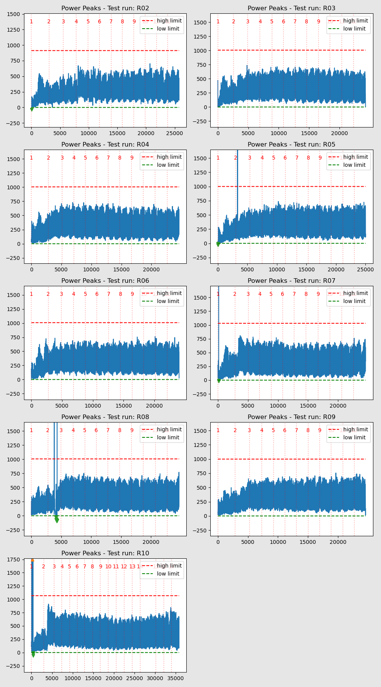

Various plots and data tables to show results of Data Cleaning for all Test Runs  
### Data Cleaning Findings 
- [Missing Data Records](MissingDataRecs.html)  
- [Global Vs Public field discrepancies](GlobalVsPublic_Fields.html)  
- [Speed Quantisation](SpeedFromOdoCount.html)  
#### Data Outliers  
- [Summary of Data Outliers](DataPeaks.html) 

#### Data Spikes  
- [Summary of Data Spikes](DataSpikes.html) 
- [Big Data Spikes sample](BigDataSpikes.html) 

#### Data Cleaned  
- [Summary of Impact of Cleaning Data ](DataCleaned.html) 

